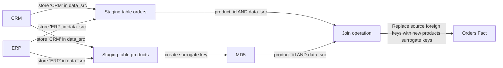
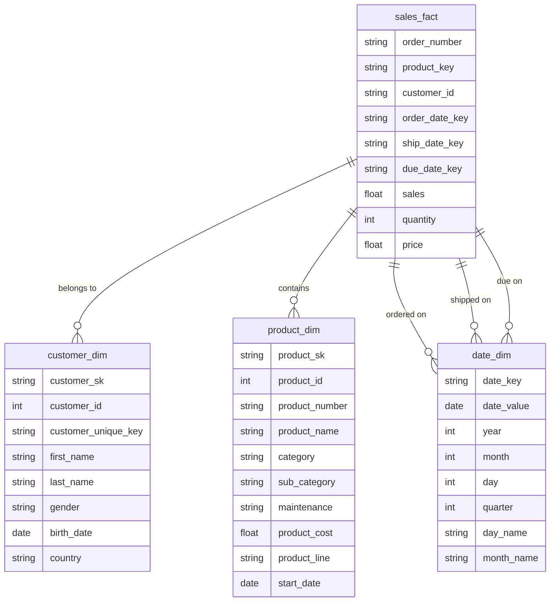

# ELT-Engine

## Table of Contents 
- [Introduction](#introduction)
- [Approach](#approach)
- [Tech Stack & Tools](#tech-stack--tools)
- [Assumptions](#assumptions)
- [Pipeline Architecture](#pipeline-architecture)
- [DBT Models](#DBT-Models)
- [Airflow DAG Overview](#airflow-dag-overview)
- [Data Warehouse Model](#data-warehouse-model)
- [Data Lineage](#data-lineage)
- [Reporting](#reporting)

## Introduction 
This project designed to ingest and transform data from multiple sources (CRM and ERP systems) into Snowflake. It follows the Medallion Architecture to structure data efficiently for analytics. The pipeline leverages dbt (Data Build Tool) to transform raw data into analytics-ready datasets, ensuring high-quality, governed, and optimized data models for reporting and business intelligence.

## Approach

## Tech Stack & Tools
- **DBT (Data Build Tool)**: For building and transforming data models.
- **Snowflake**: As the data warehouse.
- **Docker**: To containerize and standardize the development environment.
- **Python**: For scripting and automation.
- **Airflow** : For orchestrating ETL workflows.
- **Power BI** : For visualizing the reporting layer.

## Assumptions
Snowflake is the database platform used for data storage and transformations.
Docker is installed and used for containerized environments.
Required datasets are accessible in a suitable format (CSV).

## Pipeline Architecture 

The project follows the Medallion Architecture, which organizes data into three layers:

    Bronze Layer (Raw Data): Stores unprocessed and ingested data from various sources.
    Silver Layer (Cleansed Data): Cleans and pre-processes data for transformation and enrichment.
    Gold Layer (Aggregated Data): Optimized for analytics, reporting, and business intelligence.

## Airflow DAG Overview

If using Airflow for orchestration, the DAG performs the following tasks:

Extract: Reads raw data from (CRM and ERP systems) .
Load: Loads data into the Snowflake .
Transform: Executes DBT models to build Bronze Layer (Raw Data),Silver Layer (Cleansed Data) , and Gold Layer (Aggregated Data) .
see more : [airflow DAG](airflow/dags/pipeline.py)

## DBT Models
#### customer_cte
 
    {{
    config(
        materialized='incremental',
        unique_key='ID',
        indexes=[{"columns": ['ID'], "unique": true}],
        target_schema='silver'
    )
    }}
    
    with customer_cte as (
        SELECT 
            *, 
            row_number() OVER (PARTITION BY cst_id ORDER BY cst_create_date DESC) AS last_update
        FROM {{ source('row_data', 'crm_cust_info') }}
    )
    
    SELECT 
        cst_id AS ID,
        cst_key AS customer_key, 
        TRIM(cst_firstname) AS FIRST_NAME, 
        TRIM(cst_lastname) AS LAST_NAME,
        CASE 
            WHEN UPPER(cst_marital_status) = 'S' THEN 'Single'
            WHEN UPPER(cst_marital_status) = 'M' THEN 'Married'
            ELSE 'n/a'
        END AS MARITAL_STATUS,
        CASE 
            WHEN UPPER(cst_gndr) = 'F' THEN 'Female'
            WHEN UPPER(cst_gndr) = 'M' THEN 'Male'
            ELSE 'n/a'
        END AS gender,
        cst_create_date 
    FROM customer_cte
    WHERE last_update = 1 and cst_id is not null
#### sales_cte

    with sales_cte as (
        SELECT 
            sls_ord_num AS order_number,
            sls_prd_key AS product_key,
            sls_cust_id AS Customer_id,
            CASE 
                WHEN sls_order_dt = 0 OR LENGTH(sls_order_dt) != 8 THEN TO_DATE(SLS_SHIP_DT::VARCHAR, 'YYYYMMDD') - INTERVAL '2 DAY'
                ELSE TO_DATE(sls_order_dt::VARCHAR, 'YYYYMMDD') 
            END AS order_date,
            CASE 
                WHEN SLS_SHIP_DT = 0 or length(SLS_SHIP_DT) != 8 then NULL
                ELSE TO_DATE(SLS_SHIP_DT::VARCHAR,'YYYYMMDD')
            end as Ship_date,
            CASE 
                WHEN SLS_DUE_DT = 0 or length(SLS_DUE_DT) != 8 then NULL
                else to_date(SLS_DUE_DT::VARCHAR,'YYYYMMDD')
            end as DUE_Date,
            CASE 
                When sls_sales is null or sls_sales <= 0 or sls_sales != sls_quantity * abs(sls_price) then sls_quantity * abs(sls_price)
                else sls_sales
            end as sales,
            sls_quantity as quantity ,
            CASE 
                when sls_price is null or sls_price <= 0 then sls_sales / nullif(sls_quantity,0) 
                else sls_price
            end as price
        FROM {{ source('row_data', 'crm_sales_details') }} s
    )
    SELECT * from sales_cte

see more : [DBT Models](airflow/dbt/sales/models)

## Data Warehouse Model 

## Data Lineage 

## Reporting
### overview 

### customers

For any queries, feel free to reach out! 
# Project Team
This project was developed by **Ahmed Elsaba** and **Karim Yasser** for the **EDA Subject at ITI**.

## Contact Information
### Ahmed Elsaba
📧 Email: ahmed.elsaba@example.com  
🔗 LinkedIn: [Ahmed Elsaba](https://www.linkedin.com/in/ahmed-elsaba/)

### Karim Yasser
� Email: karim.yasser@example.com  
🔗 LinkedIn: [Karim Yasser](https://www.linkedin.com/in/karim-yasser/)

For any queries, feel free to reach out!

